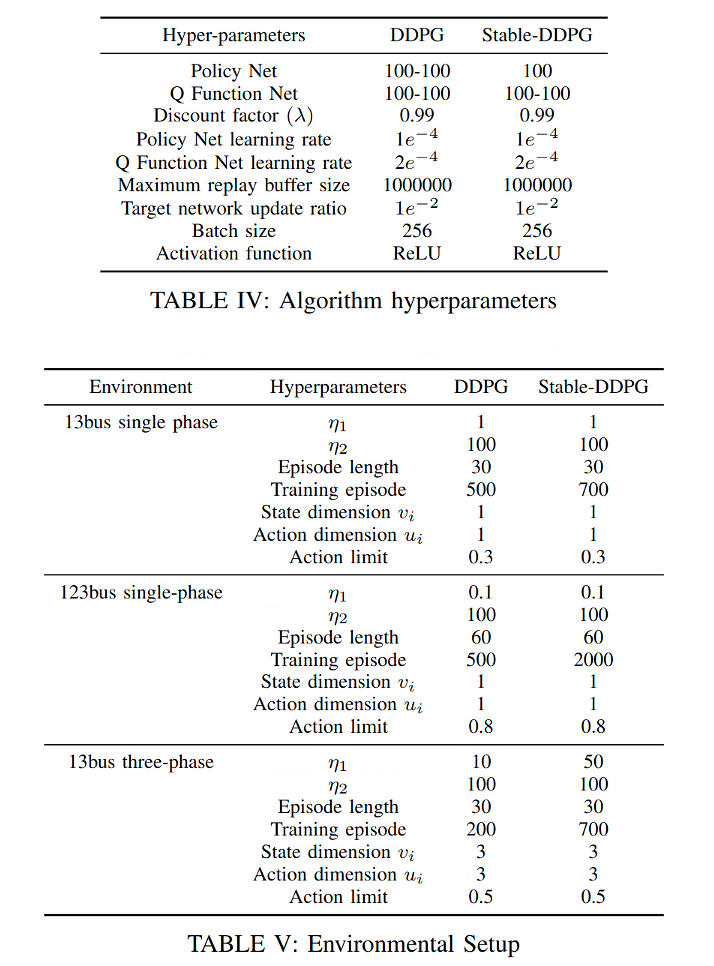

# Stability Constrained Reinforcement Learning for Real-Time Voltage Control in Distribution Systems
This repository contains source code necessary to reproduce the results presented in the paper with the same title. It also provides an OpenAI Gym environment for training various Reinforcement Learning algorithms in the IEEE-123 bus and IEEE-13 bus test case.
Authors: Jie Feng, Yuanyuan Shi, Guannan Qu, Steven H. Low, Anima Anandkumar, Adam Wierman
# hyper-parameters
