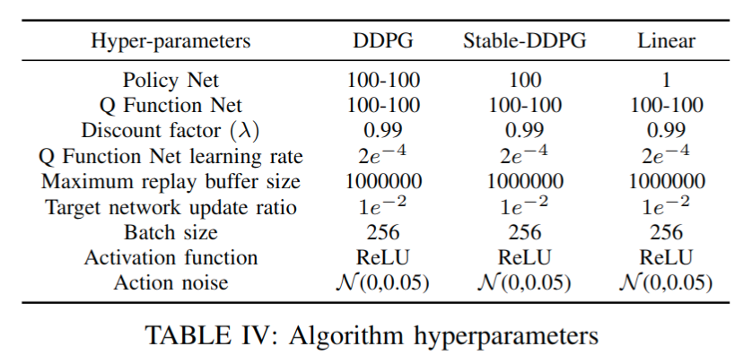
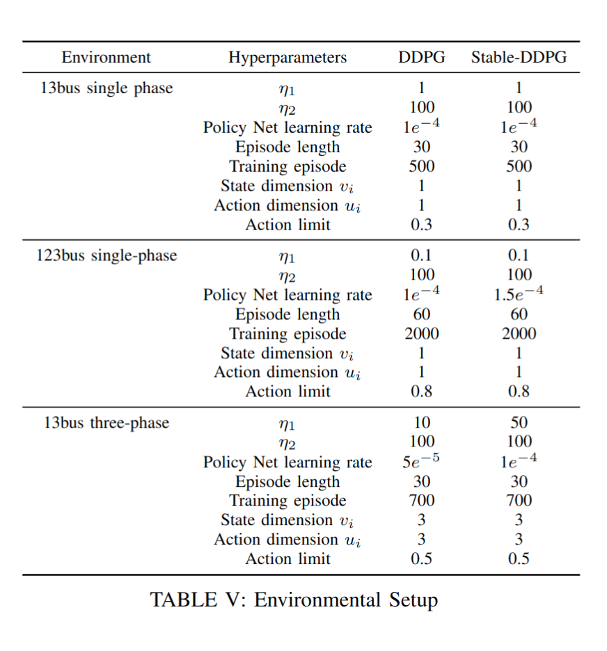

# Stability Constrained Reinforcement Learning for Real-Time Voltage Control in Distribution Systems
This repository contains source code necessary to reproduce the results presented in the paper with the same title. It also provides an OpenAI Gym environment for training various Reinforcement Learning algorithms in the IEEE-123 bus and IEEE-13 bus test case.<br />
Authors: Jie Feng, Yuanyuan Shi, Guannan Qu, Steven H. Low, Anima Anandkumar, Adam Wierman<br />
This paper is published in Transactions on Control of Network Systems (TCNS) (https://ieeexplore.ieee.org/abstract/document/10336939).
# hyper-parameters


We use a more conservative deadband for both liner and monotone neural network controller following Califronia standard. (3% instead of 5%)

# How to train
>python train_DDPG.py --algorithm safe-ddpg --env_name 13bus --status train<br />
#customize your own algorithm, env_name and status<br />
#env: 13bus,123bus,13bus3p<br />
#algorithm: linear, safe-ddpg,ddpg<br />
#status: train,test<br />
#check points are available<br />

# Real World Data
The real world PV generation and load profile is available. The trajectory can be ploted with test_real_data.py
The testing code creates a one-day trajectory (Sampling frequency 1 Hz). It will take a while to generate the plot.

# Citation
If you find our code helpful, please cite our paper! :)

````
@ARTICLE{10336939,
  author={Feng, Jie and Shi, Yuanyuan and Qu, Guannan and Low, Steven H. and Anandkumar, Anima and Wierman, Adam},
  journal={IEEE Transactions on Control of Network Systems}, 
  title={Stability Constrained Reinforcement Learning for Decentralized Real-Time Voltage Control}, 
  year={2023},
  volume={},
  number={},
  pages={1-12},
  doi={10.1109/TCNS.2023.3338240}}

````
